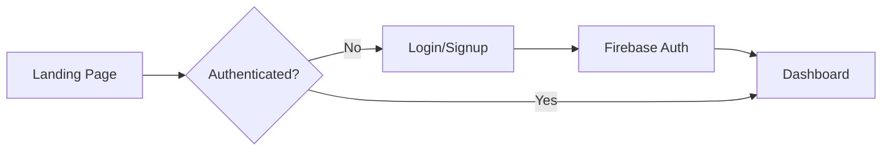
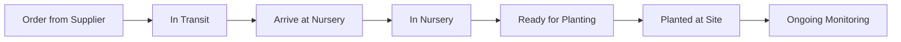

# Tree Inventory Management System - Architecture Plan

## Overview
A comprehensive React-based web application for tracking tree inventory from suppliers through nursery storage to final planting sites, with multi-user authentication and cloud data storage.

## Technology Stack

### Frontend
- **Framework**: React 18+ with TypeScript
- **Build Tool**: Vite (faster than Create React App)
- **UI Library**: Material-UI (MUI) or Tailwind CSS + Headless UI
- **State Management**: React Context API + React Query for server state
- **Routing**: React Router v6
- **Forms**: React Hook Form + Zod validation
- **Date Handling**: date-fns
- **Maps**: Leaflet or Google Maps API for GPS coordinates
- **Charts**: Recharts or Chart.js for visualizations
- **File Upload**: Firebase Storage integration

### Backend & Infrastructure
- **Authentication**: Firebase Authentication (email/password, Google OAuth)
- **Database**: Cloud Firestore (NoSQL, real-time)
- **File Storage**: Firebase Storage (for tree photos)
- **Hosting**: GitHub Pages (static site)
- **CI/CD**: GitHub Actions for automated deployment

## Data Model

### Collections Structure

#### Users Collection
```typescript
interface User {
  uid: string;
  email: string;
  displayName: string;
  role: 'admin' | 'editor' | 'viewer';
  createdAt: Timestamp;
  lastLogin: Timestamp;
}
```

#### Trees Collection
```typescript
interface Tree {
  id: string;
  
  // Basic Information
  species: string;
  commonName?: string;
  provenance: string;
  
  // Workflow Status
  status: 'ordered' | 'in_transit' | 'in_nursery' | 'planted' | 'deceased';
  
  // Supplier Information
  supplierId: string;
  supplierName: string;
  purchaseOrderNumber?: string;
  cost?: number;
  orderDate: Timestamp;
  arrivalDate?: Timestamp;
  
  // Physical Attributes
  initialHeight?: number;
  initialDiameter?: number;
  age?: number;
  
  // Location Tracking
  nurseryLocationId?: string;
  plantingSiteId?: string;
  gpsCoordinates?: {
    latitude: number;
    longitude: number;
  };
  
  // Health & Condition
  healthStatus: 'excellent' | 'good' | 'fair' | 'poor' | 'critical';
  soilConditions?: string;
  
  // Photos
  photoUrls: string[];
  
  // Notes & History
  notes: string;
  
  // Metadata
  createdBy: string;
  createdAt: Timestamp;
  updatedAt: Timestamp;
}
```

#### GrowthMeasurements Subcollection (trees/{treeId}/measurements)
```typescript
interface GrowthMeasurement {
  id: string;
  treeId: string;
  date: Timestamp;
  height: number;
  diameter: number;
  canopySpread?: number;
  notes?: string;
  measuredBy: string;
}
```

#### MaintenanceHistory Subcollection (trees/{treeId}/maintenance)
```typescript
interface MaintenanceRecord {
  id: string;
  treeId: string;
  date: Timestamp;
  type: 'watering' | 'fertilizing' | 'pruning' | 'treatment' | 'inspection' | 'other';
  description: string;
  performedBy: string;
  nextScheduledDate?: Timestamp;
}
```

#### DiseaseTracking Subcollection (trees/{treeId}/diseases)
```typescript
interface DiseaseRecord {
  id: string;
  treeId: string;
  detectedDate: Timestamp;
  diseaseName: string;
  severity: 'mild' | 'moderate' | 'severe';
  symptoms: string;
  treatment?: string;
  resolvedDate?: Timestamp;
  status: 'active' | 'treated' | 'resolved';
  photos: string[];
}
```

#### Suppliers Collection
```typescript
interface Supplier {
  id: string;
  name: string;
  contactPerson?: string;
  email?: string;
  phone?: string;
  address?: string;
  notes?: string;
  active: boolean;
}
```

#### NurseryLocations Collection
```typescript
interface NurseryLocation {
  id: string;
  name: string;
  section?: string;
  capacity: number;
  currentOccupancy: number;
  gpsCoordinates?: {
    latitude: number;
    longitude: number;
  };
  notes?: string;
}
```

#### PlantingSites Collection
```typescript
interface PlantingSite {
  id: string;
  name: string;
  address?: string;
  gpsCoordinates: {
    latitude: number;
    longitude: number;
  };
  soilType?: string;
  sunExposure?: 'full_sun' | 'partial_shade' | 'full_shade';
  notes?: string;
}
```

## Application Structure

```
src/
├── components/
│   ├── auth/
│   │   ├── LoginForm.tsx
│   │   ├── SignupForm.tsx
│   │   └── PasswordReset.tsx
│   ├── layout/
│   │   ├── AppLayout.tsx
│   │   ├── Header.tsx
│   │   ├── Sidebar.tsx
│   │   └── Footer.tsx
│   ├── trees/
│   │   ├── TreeList.tsx
│   │   ├── TreeCard.tsx
│   │   ├── TreeDetail.tsx
│   │   ├── TreeForm.tsx
│   │   ├── TreeFilters.tsx
│   │   └── TreeStatusBadge.tsx
│   ├── measurements/
│   │   ├── MeasurementForm.tsx
│   │   ├── MeasurementChart.tsx
│   │   └── MeasurementHistory.tsx
│   ├── maintenance/
│   │   ├── MaintenanceForm.tsx
│   │   ├── MaintenanceList.tsx
│   │   └── WateringSchedule.tsx
│   ├── diseases/
│   │   ├── DiseaseForm.tsx
│   │   ├── DiseaseList.tsx
│   │   └── DiseaseAlerts.tsx
│   ├── suppliers/
│   │   ├── SupplierList.tsx
│   │   └── SupplierForm.tsx
│   ├── locations/
│   │   ├── NurseryLocationList.tsx
│   │   ├── PlantingSiteList.tsx
│   │   └── LocationMap.tsx
│   ├── dashboard/
│   │   ├── Dashboard.tsx
│   │   ├── StatisticsCards.tsx
│   │   └── Charts.tsx
│   ├── common/
│   │   ├── LoadingSpinner.tsx
│   │   ├── ErrorBoundary.tsx
│   │   ├── ConfirmDialog.tsx
│   │   └── PhotoUpload.tsx
│   └── export/
│       └── ExportDialog.tsx
├── contexts/
│   ├── AuthContext.tsx
│   └── ThemeContext.tsx
├── hooks/
│   ├── useAuth.ts
│   ├── useTrees.ts
│   ├── useSuppliers.ts
│   └── useLocations.ts
├── services/
│   ├── firebase.ts
│   ├── auth.service.ts
│   ├── trees.service.ts
│   ├── suppliers.service.ts
│   └── export.service.ts
├── types/
│   ├── tree.types.ts
│   ├── user.types.ts
│   └── common.types.ts
├── utils/
│   ├── validation.ts
│   ├── formatters.ts
│   └── constants.ts
├── App.tsx
├── main.tsx
└── routes.tsx
```

## Key Features & User Flows

### 1. Authentication Flow


### 2. Tree Lifecycle Workflow


### 3. Main Navigation Structure
- **Dashboard**: Overview statistics, recent activities, alerts
- **Trees**: List, search, filter, add new trees
- **Suppliers**: Manage supplier information
- **Locations**: Nursery locations and planting sites
- **Reports**: Export data, generate reports
- **Settings**: User profile, preferences, admin controls

## Security Considerations

### Firestore Security Rules
```javascript
rules_version = '2';
service cloud.firestore {
  match /databases/{database}/documents {
    // Helper functions
    function isAuthenticated() {
      return request.auth != null;
    }
    
    function isAdmin() {
      return isAuthenticated() && 
             get(/databases/$(database)/documents/users/$(request.auth.uid)).data.role == 'admin';
    }
    
    function isEditor() {
      return isAuthenticated() && 
             get(/databases/$(database)/documents/users/$(request.auth.uid)).data.role in ['admin', 'editor'];
    }
    
    // Users collection
    match /users/{userId} {
      allow read: if isAuthenticated();
      allow write: if isAdmin();
    }
    
    // Trees collection
    match /trees/{treeId} {
      allow read: if isAuthenticated();
      allow create, update: if isEditor();
      allow delete: if isAdmin();
      
      // Subcollections
      match /measurements/{measurementId} {
        allow read: if isAuthenticated();
        allow write: if isEditor();
      }
      
      match /maintenance/{maintenanceId} {
        allow read: if isAuthenticated();
        allow write: if isEditor();
      }
      
      match /diseases/{diseaseId} {
        allow read: if isAuthenticated();
        allow write: if isEditor();
      }
    }
    
    // Suppliers, locations
    match /{document=**} {
      allow read: if isAuthenticated();
      allow write: if isEditor();
    }
  }
}
```

### Firebase Storage Rules
```javascript
rules_version = '2';
service firebase.storage {
  match /b/{bucket}/o {
    match /tree-photos/{treeId}/{fileName} {
      allow read: if request.auth != null;
      allow write: if request.auth != null && 
                     request.resource.size < 5 * 1024 * 1024 && // 5MB limit
                     request.resource.contentType.matches('image/.*');
    }
  }
}
```

## Deployment Strategy

### GitHub Pages Configuration
1. Build React app as static files
2. Use HashRouter instead of BrowserRouter (GitHub Pages limitation)
3. Configure `gh-pages` package for deployment
4. Set up GitHub Actions for CI/CD

### Environment Variables
```env
VITE_FIREBASE_API_KEY=your_api_key
VITE_FIREBASE_AUTH_DOMAIN=your_auth_domain
VITE_FIREBASE_PROJECT_ID=your_project_id
VITE_FIREBASE_STORAGE_BUCKET=your_storage_bucket
VITE_FIREBASE_MESSAGING_SENDER_ID=your_sender_id
VITE_FIREBASE_APP_ID=your_app_id
```

### GitHub Actions Workflow
```yaml
name: Deploy to GitHub Pages

on:
  push:
    branches: [ main ]

jobs:
  build-and-deploy:
    runs-on: ubuntu-latest
    steps:
      - uses: actions/checkout@v3
      - uses: actions/setup-node@v3
        with:
          node-version: '18'
      - run: npm ci
      - run: npm run build
        env:
          VITE_FIREBASE_API_KEY: ${{ secrets.FIREBASE_API_KEY }}
          # ... other env vars
      - uses: peaceiris/actions-gh-pages@v3
        with:
          github_token: ${{ secrets.GITHUB_TOKEN }}
          publish_dir: ./dist
```

## Performance Optimization

1. **Code Splitting**: Lazy load routes and heavy components
2. **Image Optimization**: Compress and resize photos before upload
3. **Pagination**: Implement virtual scrolling for large tree lists
4. **Caching**: Use React Query for intelligent data caching
5. **Firestore Indexes**: Create composite indexes for common queries
6. **Bundle Size**: Tree-shake unused dependencies

## Testing Strategy

1. **Unit Tests**: Jest + React Testing Library for components
2. **Integration Tests**: Test Firebase interactions with emulators
3. **E2E Tests**: Cypress for critical user flows
4. **Manual Testing**: Cross-browser and mobile device testing

## Future Enhancements

1. **Mobile App**: React Native version for field use
2. **Offline Support**: PWA with service workers
3. **Barcode/QR Codes**: Generate and scan tree tags
4. **Weather Integration**: Automatic weather data for sites
5. **Notifications**: Email/push alerts for maintenance schedules
6. **Advanced Analytics**: ML-based health predictions
7. **Bulk Import**: CSV import for existing inventory
8. **API Access**: REST API for third-party integrations

## Timeline Estimate

- **Phase 1** (Week 1-2): Project setup, authentication, basic CRUD
- **Phase 2** (Week 3-4): Core features, workflow tracking, measurements
- **Phase 3** (Week 5-6): Advanced features, disease tracking, maintenance
- **Phase 4** (Week 7): Dashboard, reports, export functionality
- **Phase 5** (Week 8): Testing, optimization, deployment

Total estimated time: **8 weeks** for full implementation