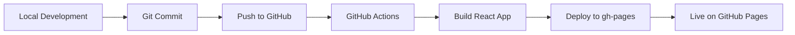

# Tree Inventory Management System - Project Summary

## 🎯 Project Overview

A comprehensive web application for tracking trees from supplier purchase through nursery storage to final planting, with detailed health monitoring, maintenance tracking, and multi-user collaboration.

## 🏗️ Technology Stack

| Category | Technology | Purpose |
|----------|-----------|---------|
| **Frontend** | React 18 + TypeScript | UI framework with type safety |
| **Build Tool** | Vite | Fast development and optimized builds |
| **UI Framework** | Material-UI (MUI) | Professional component library |
| **State Management** | React Query + Context | Server state caching and global state |
| **Authentication** | Firebase Auth | User login and security |
| **Database** | Cloud Firestore | Real-time NoSQL database |
| **Storage** | Firebase Storage | Photo and file uploads |
| **Hosting** | GitHub Pages | Free static site hosting |
| **Forms** | React Hook Form + Zod | Form handling and validation |
| **Maps** | Leaflet | GPS coordinate visualization |
| **Charts** | Recharts | Data visualization |

## 📊 Core Features

### 1. Tree Lifecycle Management
Track trees through their complete journey:
- **Ordered** → From supplier
- **In Transit** → Shipping to nursery
- **In Nursery** → Temporary storage
- **Planted** → Final destination
- **Deceased** → End of lifecycle

### 2. Comprehensive Tree Data
Each tree includes:
- Species, common name, provenance
- Supplier information and purchase details
- Physical measurements (height, diameter, age)
- Health status tracking
- GPS coordinates
- Multiple photos
- Custom notes

### 3. Growth Tracking
Monitor tree development over time:
- Regular measurements (height, diameter, canopy)
- Historical growth charts
- Comparison across time periods

### 4. Maintenance Management
Schedule and track care activities:
- Watering schedules
- Fertilization records
- Pruning history
- General inspections
- Automated reminders

### 5. Disease Monitoring
Track and manage tree health issues:
- Disease identification
- Severity tracking
- Treatment records
- Photo documentation
- Resolution tracking

### 6. Location Management
Organize physical spaces:
- **Nursery Locations**: Sections, capacity, occupancy
- **Planting Sites**: GPS coordinates, soil type, sun exposure
- Interactive maps

### 7. Supplier Management
Track tree sources:
- Contact information
- Purchase history
- Performance notes

### 8. Dashboard & Analytics
Visual insights:
- Total tree count by status
- Health distribution
- Recent activities
- Upcoming maintenance
- Custom reports

### 9. Data Export
Generate reports:
- CSV export for spreadsheets
- PDF reports for documentation
- Filtered data exports

### 10. User Management
Role-based access:
- **Admin**: Full system access
- **Editor**: Create and modify records
- **Viewer**: Read-only access

## 🔐 Security Features

- Email/password authentication
- Google OAuth integration
- Role-based permissions
- Firestore security rules
- Secure file uploads (5MB limit, images only)
- Environment variable protection

## 📱 User Interface

### Main Navigation
```
┌─────────────────────────────────────┐
│  🌳 Tree Inventory System           │
├─────────────────────────────────────┤
│  📊 Dashboard                        │
│  🌲 Trees                            │
│  🏢 Suppliers                        │
│  📍 Locations                        │
│  📈 Reports                          │
│  ⚙️  Settings                        │
└─────────────────────────────────────┘
```

### Tree Card View
```
┌──────────────────────────────┐
│ 🌲 Red Oak                   │
│ Quercus rubra                │
│                              │
│ 📍 Nursery Section A-12      │
│ 💚 Health: Excellent         │
│ 📊 Status: In Nursery        │
│                              │
│ [View Details] [Edit]        │
└──────────────────────────────┘
```

## 🗂️ Data Structure

### Main Collections
1. **users** - User accounts and roles
2. **trees** - Primary tree inventory
3. **suppliers** - Supplier information
4. **nurseryLocations** - Nursery sections
5. **plantingSites** - Final planting locations

### Tree Subcollections
- **measurements** - Growth tracking over time
- **maintenance** - Care activity history
- **diseases** - Health issue tracking

## 🚀 Deployment Process



## 📈 Development Phases

### Phase 1: Foundation (Weeks 1-2)
- ✅ Project setup with Vite + React + TypeScript
- ✅ Firebase configuration
- ✅ Authentication system
- ✅ Basic routing and layout

### Phase 2: Core Features (Weeks 3-4)
- ✅ Tree CRUD operations
- ✅ Workflow status tracking
- ✅ Basic list and detail views
- ✅ Form validation

### Phase 3: Advanced Features (Weeks 5-6)
- ✅ Growth measurements
- ✅ Maintenance tracking
- ✅ Disease monitoring
- ✅ Photo uploads

### Phase 4: Polish & Deploy (Week 7-8)
- ✅ Dashboard and analytics
- ✅ Export functionality
- ✅ Mobile responsiveness
- ✅ Testing and deployment

## 💡 Key Design Decisions

### Why React + TypeScript?
- Type safety prevents bugs
- Large ecosystem and community
- Excellent developer experience

### Why Firebase?
- No backend code needed
- Real-time updates out of the box
- Built-in authentication
- Generous free tier
- Easy to scale

### Why GitHub Pages?
- Free hosting
- Automatic HTTPS
- Simple deployment
- Version control integration

### Why Material-UI?
- Professional appearance
- Comprehensive components
- Accessibility built-in
- Responsive by default

## 🎨 Design Principles

1. **Mobile-First**: Works on phones, tablets, and desktops
2. **User-Friendly**: Intuitive navigation and clear actions
3. **Data-Rich**: Comprehensive information without clutter
4. **Real-Time**: Instant updates across users
5. **Reliable**: Proper error handling and loading states
6. **Secure**: Role-based access and data protection

## 📊 Expected Performance

- **Initial Load**: < 3 seconds
- **Page Navigation**: < 500ms
- **Data Updates**: Real-time (< 1 second)
- **Photo Upload**: < 5 seconds per image
- **Search/Filter**: < 200ms

## 🔮 Future Enhancements

1. **Mobile App**: Native iOS/Android with React Native
2. **Offline Mode**: PWA with service workers
3. **Barcode Scanning**: QR codes for quick tree lookup
4. **Weather Integration**: Automatic weather data
5. **Email Notifications**: Maintenance reminders
6. **Bulk Import**: CSV upload for existing inventory
7. **Advanced Analytics**: ML-based health predictions
8. **API Access**: REST API for integrations

## 📚 Documentation Structure

- **README.md**: Project overview and quick start
- **ARCHITECTURE.md**: Technical architecture and data models
- **IMPLEMENTATION_GUIDE.md**: Step-by-step development guide
- **PROJECT_SUMMARY.md**: This file - high-level overview

## 🤝 Getting Started

1. Review this summary for overview
2. Read ARCHITECTURE.md for technical details
3. Follow IMPLEMENTATION_GUIDE.md for step-by-step setup
4. Refer to todo list for task tracking

## 📞 Support & Resources

- **React Docs**: https://react.dev/
- **Firebase Docs**: https://firebase.google.com/docs
- **Material-UI Docs**: https://mui.com/
- **TypeScript Docs**: https://www.typescriptlang.org/docs/

## ✅ Success Criteria

The project is complete when:
- ✅ Users can log in securely
- ✅ Trees can be created, viewed, edited, deleted
- ✅ Workflow status can be updated
- ✅ Photos can be uploaded and viewed
- ✅ Measurements can be tracked over time
- ✅ Maintenance can be scheduled and recorded
- ✅ Diseases can be documented
- ✅ Dashboard shows key metrics
- ✅ Data can be exported
- ✅ Application is deployed to GitHub Pages
- ✅ Mobile devices are supported
- ✅ Multiple users can collaborate

## 🎯 Project Goals

**Primary Goal**: Create a professional, user-friendly system for comprehensive tree inventory management from supplier to final planting.

**Secondary Goals**:
- Enable data-driven decision making
- Improve tree survival rates through better tracking
- Streamline nursery operations
- Facilitate team collaboration
- Provide historical records for analysis

---

**Estimated Timeline**: 8 weeks
**Estimated Cost**: Free (using free tiers)
**Team Size**: 1-2 developers
**Skill Level**: Intermediate React/TypeScript