# Tree Inventory System - Visual Architecture

## System Overview Diagram

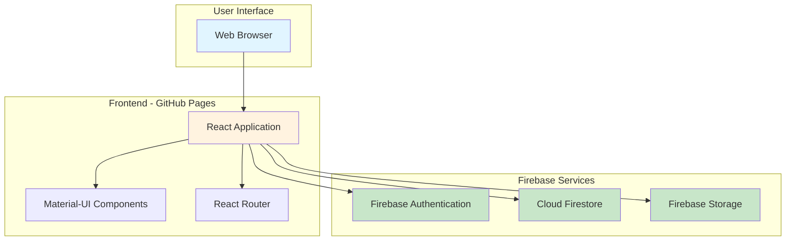

## Application Architecture

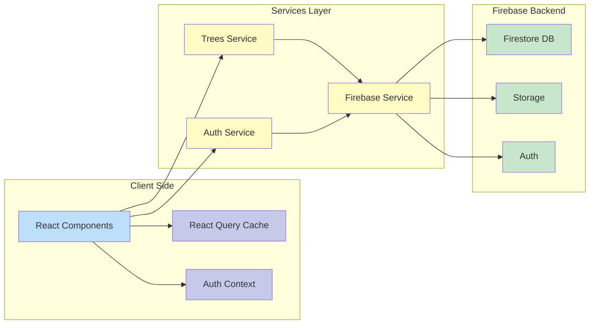

## User Authentication Flow

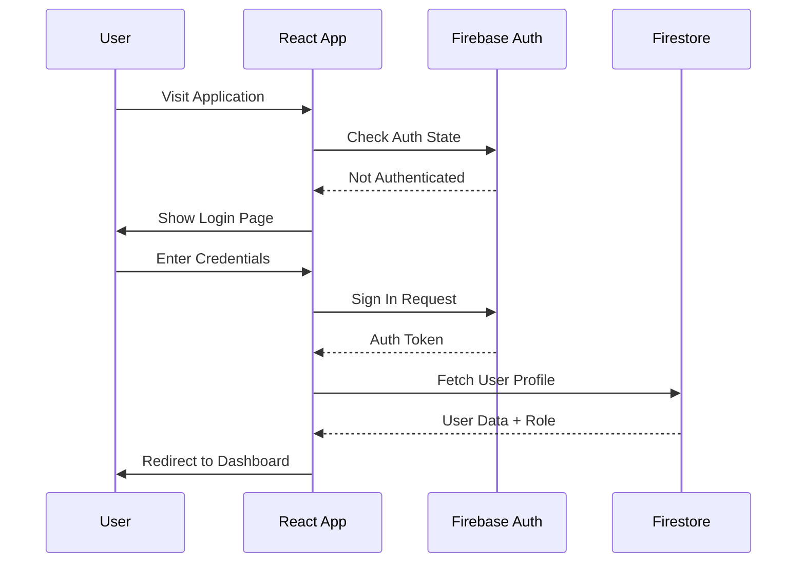

## Tree Lifecycle Workflow

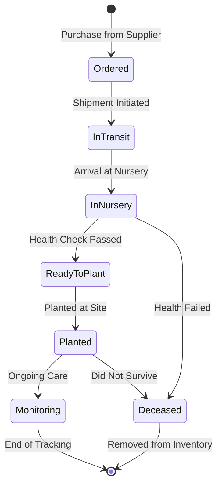

## Data Model Relationships

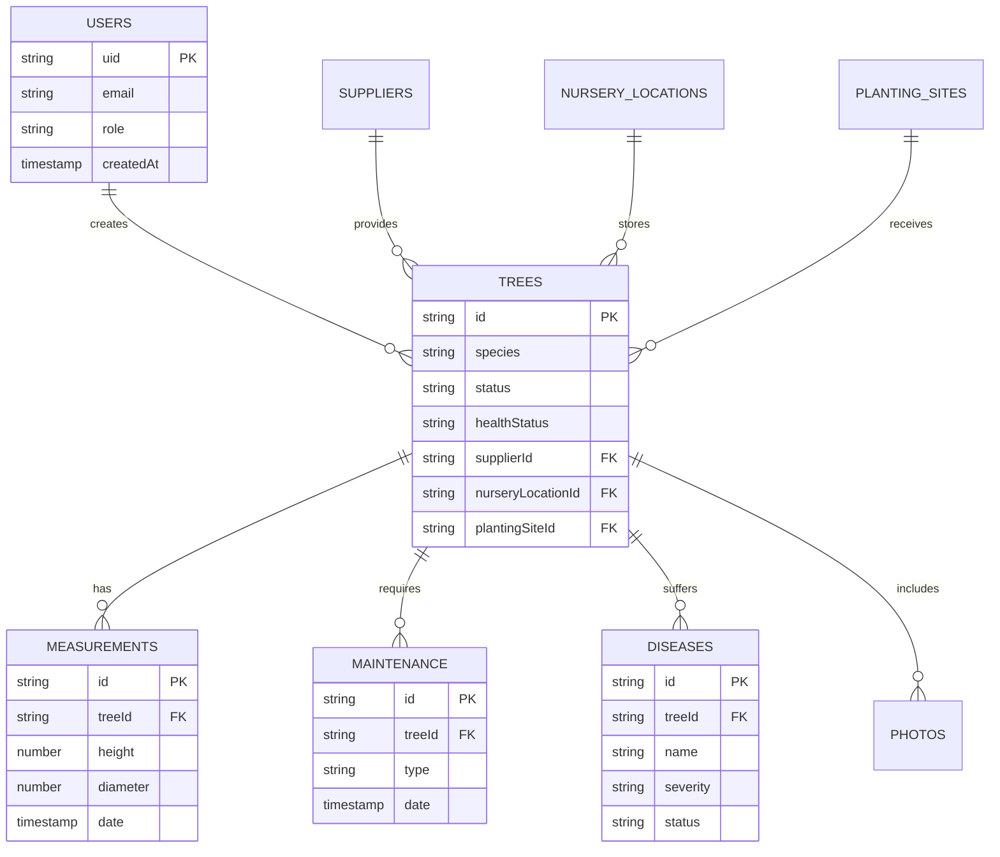

## Component Hierarchy

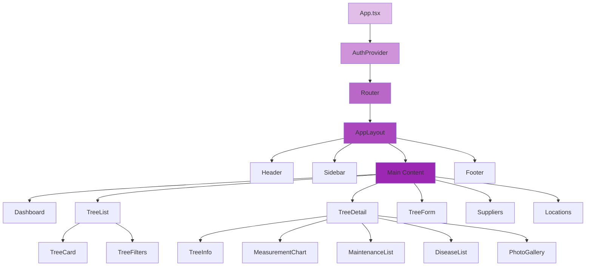

## Data Flow - Creating a Tree

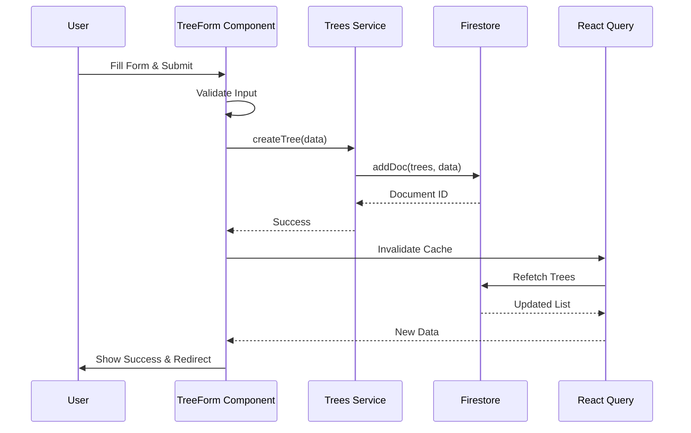

## Photo Upload Flow

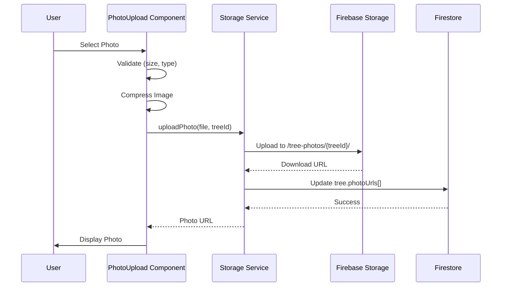

## Real-Time Updates Flow

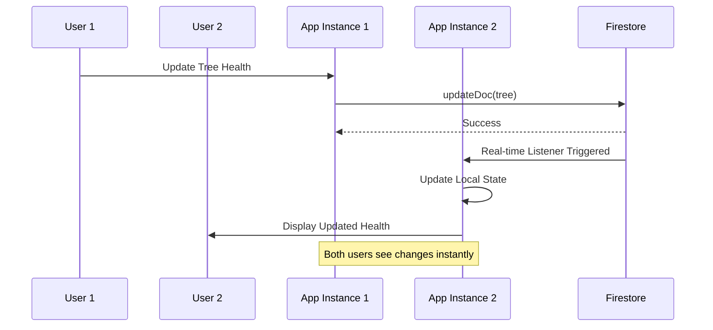

## Security Rules Architecture

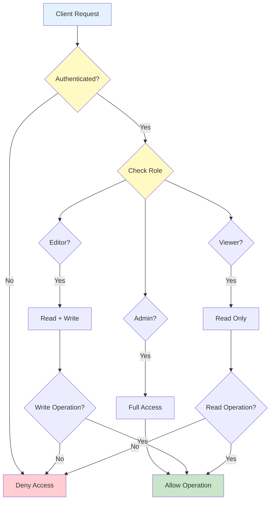

## Deployment Pipeline

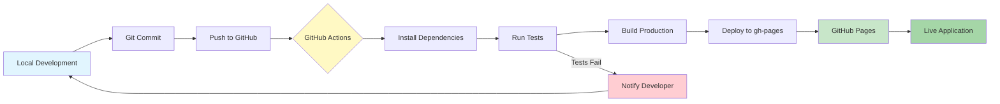

## Mobile Responsive Layout

```
┌─────────────────────────────────────┐
│  Desktop (>960px)                   │
├──────────┬──────────────────────────┤
│          │                          │
│ Sidebar  │   Main Content           │
│          │                          │
│ - Trees  │   ┌──────┬──────┬──────┐│
│ - Dash   │   │ Card │ Card │ Card ││
│ - Supp   │   └──────┴──────┴──────┘│
│ - Loc    │   ┌──────┬──────┬──────┐│
│          │   │ Card │ Card │ Card ││
│          │   └──────┴──────┴──────┘│
└──────────┴──────────────────────────┘

┌─────────────────────┐
│  Tablet (600-960px) │
├─────────────────────┤
│  ☰ Menu   🌳 Title  │
├─────────────────────┤
│  ┌────────┬────────┐│
│  │  Card  │  Card  ││
│  └────────┴────────┘│
│  ┌────────┬────────┐│
│  │  Card  │  Card  ││
│  └────────┴────────┘│
└─────────────────────┘

┌──────────────┐
│ Mobile (<600)│
├──────────────┤
│ ☰  🌳 Title  │
├──────────────┤
│ ┌──────────┐ │
│ │   Card   │ │
│ └──────────┘ │
│ ┌──────────┐ │
│ │   Card   │ │
│ └──────────┘ │
│ ┌──────────┐ │
│ │   Card   │ │
│ └──────────┘ │
└──────────────┘
```

## Dashboard Layout

```
┌─────────────────────────────────────────────────────────┐
│  🌳 Tree Inventory Dashboard                            │
├─────────────────────────────────────────────────────────┤
│                                                         │
│  ┌──────────┐  ┌──────────┐  ┌──────────┐  ┌─────────┐│
│  │   Total  │  │   In     │  │  Planted │  │ Critical││
│  │   Trees  │  │  Nursery │  │          │  │  Health ││
│  │   1,234  │  │    456   │  │    678   │  │    12   ││
│  └──────────┘  └──────────┘  └──────────┘  └─────────┘│
│                                                         │
│  ┌─────────────────────────┐  ┌─────────────────────┐ │
│  │  Health Distribution    │  │  Recent Activities  │ │
│  │                         │  │                     │ │
│  │  [Pie Chart]            │  │  • Tree #123 added  │ │
│  │                         │  │  • Watering done    │ │
│  │                         │  │  • Disease detected │ │
│  └─────────────────────────┘  └─────────────────────┘ │
│                                                         │
│  ┌───────────────────────────────────────────────────┐ │
│  │  Growth Over Time                                 │ │
│  │                                                   │ │
│  │  [Line Chart showing height measurements]        │ │
│  │                                                   │ │
│  └───────────────────────────────────────────────────┘ │
└─────────────────────────────────────────────────────────┘
```

## Tree Detail View Layout

```
┌─────────────────────────────────────────────────────────┐
│  ← Back to List          Red Oak (Quercus rubra)   [Edit]│
├─────────────────────────────────────────────────────────┤
│                                                         │
│  ┌─────────────────┐  ┌─────────────────────────────┐ │
│  │                 │  │  Status: In Nursery         │ │
│  │  [Tree Photo]   │  │  Health: Excellent          │ │
│  │                 │  │  Location: Section A-12     │ │
│  │                 │  │  Supplier: Green Nursery    │ │
│  └─────────────────┘  │  Arrived: 2024-03-15        │ │
│                       └─────────────────────────────┘ │
│                                                         │
│  ┌─────────────────────────────────────────────────────┐│
│  │  📊 Measurements  🔧 Maintenance  🦠 Diseases  📝 Notes││
│  ├─────────────────────────────────────────────────────┤│
│  │                                                     ││
│  │  [Growth Chart]                                     ││
│  │                                                     ││
│  │  Latest: Height 2.5m, Diameter 8cm (2024-04-01)    ││
│  │                                                     ││
│  │  [Add New Measurement]                              ││
│  └─────────────────────────────────────────────────────┘│
└─────────────────────────────────────────────────────────┘
```

## File Structure Visualization

```
tree-inventory/
├── public/
│   └── favicon.ico
├── src/
│   ├── components/
│   │   ├── auth/
│   │   │   ├── LoginForm.tsx
│   │   │   ├── SignupForm.tsx
│   │   │   └── PasswordReset.tsx
│   │   ├── layout/
│   │   │   ├── AppLayout.tsx
│   │   │   ├── Header.tsx
│   │   │   ├── Sidebar.tsx
│   │   │   └── Footer.tsx
│   │   ├── trees/
│   │   │   ├── TreeList.tsx
│   │   │   ├── TreeCard.tsx
│   │   │   ├── TreeDetail.tsx
│   │   │   └── TreeForm.tsx
│   │   ├── dashboard/
│   │   │   ├── Dashboard.tsx
│   │   │   └── StatisticsCards.tsx
│   │   └── common/
│   │       ├── LoadingSpinner.tsx
│   │       └── ErrorBoundary.tsx
│   ├── contexts/
│   │   └── AuthContext.tsx
│   ├── services/
│   │   ├── firebase.ts
│   │   ├── auth.service.ts
│   │   └── trees.service.ts
│   ├── types/
│   │   └── tree.types.ts
│   ├── App.tsx
│   └── main.tsx
├── .env.local (not committed)
├── package.json
├── vite.config.ts
└── tsconfig.json
```

## Performance Optimization Strategy

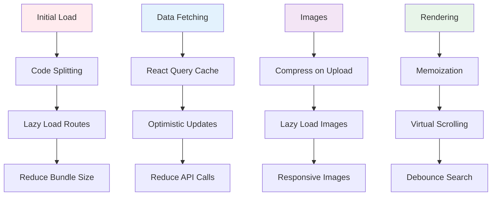

---

## Legend

### Diagram Types Used

- **Graph TB/LR**: System architecture and relationships
- **Sequence Diagram**: Process flows and interactions
- **State Diagram**: Workflow states and transitions
- **ER Diagram**: Database relationships
- **Flowchart**: Decision trees and logic flows

### Color Coding

- 🔵 Blue: User interface and client-side
- 🟡 Yellow: Services and middleware
- 🟢 Green: Backend and database
- 🔴 Red: Errors and failures
- 🟣 Purple: Components and React

---

These diagrams provide visual representations of the system architecture, data flows, and user interactions. Use them alongside the written documentation for a complete understanding of the application structure.